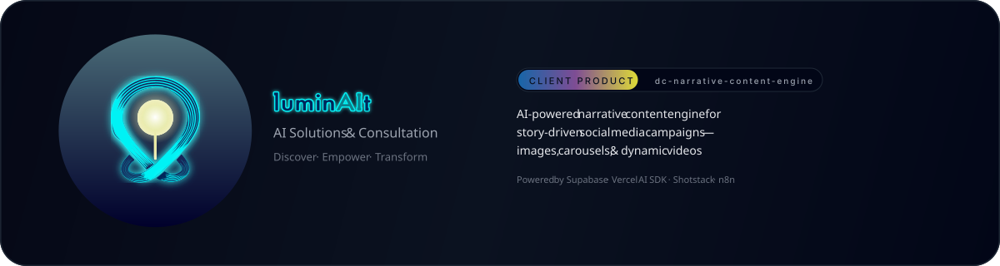
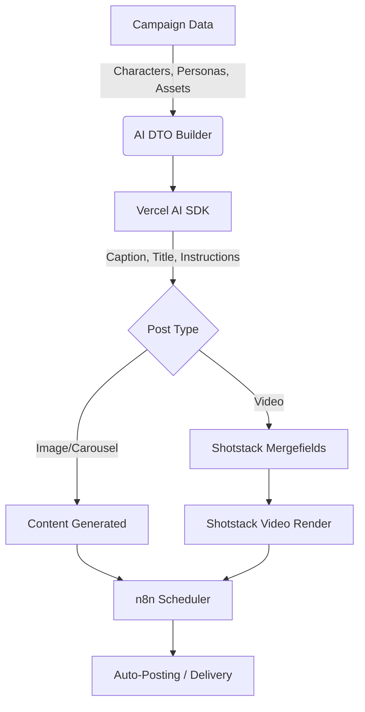

<!--suppress ALL -->
<p align="center">
  
</p>


<p align="center">
  <strong>Create story-driven social media content—at scale—through campaigns, characters, personas, AI pipelines, and dynamic video templates.</strong>
</p>


⸻


<!--suppress HtmlDeprecatedAttribute -->
<div align="center">


Built With

 


</div>


⸻

# 🌟 What This Engine Does

dc-narrative-content-engine is an AI-powered narrative automation platform that transforms structured campaign data into fully produced, story-driven social media content.

**It blends:**

* Character personalities 
* Target personas 
* Narrative context 
* Shotstack video merge fields 
* Vercel AI SDK + LLMs 
* Supabase assets + campaign data 
* n8n automations for scheduling and posting

Into a seamless pipeline capable of generating:
* Images & carousels
* Dynamic videos assembled via mergefields
* Captions (short/medium/long)
* Narrative sequences

All derived from a single campaign definition.

⸻

# 🧭 Table of Contents
* Architecture
* Folder Structure
* Core Concepts
* AI Generation Pipeline
* Database Schema Summary
* Asset Management
* Shotstack Integration
* n8n Integration
* Deployment
* Local Development
* AI DTO Contract
* Examples
* Roadmap

⸻

# 🏛 Architecture

### High-Level System Flow



⸻

# 📁 Folder Structure

```markdown

dc-narrative-content-engine/
├── app/                       # Next.js App Router
│   ├── api/
│   │   └── ai/
│   │       └── posts/generate/
│   ├── campaigns/
│   └── ...
├── src/
│   ├── server/
│   │   ├── ai/
│   │   │   ├── dto.ts
│   │   │   ├── buildAiGenerationJob.ts
│   │   ├── db/prisma/
│   │   └── utils/
│   ├── features/
│   └── lib/
└── .env
└── .env.local

```


⸻

# 🎭 Core Concepts

Campaigns
* Define the objective
* Narrative context
* Schedule + cadence
* Post type (image / carousel / video)
* Caption length
* Personas + characters
* Associated mergefields

Campaigns = story frameworks.

⸻

## Characters

Characters are narrative agents, not just visual assets.

They have:
* Personality
* Moral alignment
* Height/weight
* Assets (image, video, audio)
* Behavioral tone
* Narrative role within campaigns

⸻

## Personas

Personas define target audience groups.

Used for:
* Copy tone
* Caption language
* Hashtag selection
* Narrative framing

⸻

## Posts

Posts inherited from the campaign by default but can include:
* Custom instructions
* Overrides
* Schedule
* Mergefield replacements

⸻

# 🤖 AI Generation Pipeline

The pipeline is modular:

Campaign → DTO Builder → AI Model → Post Content → (Video? Shotstack → n8n)

Pipeline Stages
1. DTO Builder 
   * Converts relational campaign schema into AiGenerationJob.
2. AI Model Execution 
   * Vercel AI SDK
   * Model providers: OpenAI / Anthropic / etc.
3. Content Assembly 
   * Title
   * Caption
   * Hashtags
   * Narrative metadata
4. Video Branch (if chosen)
   * Shotstack mergefields
   * Shotstack render request
5. Automation (via n8n):
   * Scheduling 
   * Reposting 
   * Versioning 
   * Notifications

⸻

# 🗄 Database Schema Summary

Uses Supabase Postgres with Prisma.

Includes:
* Campaign
* Character
* Persona
* Posts
* Images
* Character Assets
* Shotstack Merge Fields
* Shotstack Render Jobs
* App Settings
* StorageObject

RLS enabled on all core tables.

⸻

🖼 Asset Management

Assets stored in Supabase Storage.

A dedicated Supabase Edge Function resolves:

asset_ref_uuid → asset public URL

Example response:
```json
{
  "asset_ref":"f2f00b19-4489-4a0c-bbc0-4b251e4af773",
  "asset_url":"https://project.supabase.co/storage/v1/object/public/.../greninja.png"
}
```

⸻

🎬 Shotstack Integration

Shotstack is used for video assembly.

Mergefields define:
* Media
* Position
* Timing
* Layers
* FX
* Opacity
* Audio
* Duration

The AI produces a structured mapping → Shotstack template → final rendered video.

⸻

# 🔄 n8n Integration

n8n handles:
* Post scheduling
* Webhook-based generation triggers
* Auto-posting
* Multi-platform delivery
* Complex sequences (weekly, daily)

This enables hands-free content pipelines.

⸻

# ☁️ Deployment

Primary Hosting
Vercel (Next.js + server actions)

Database + Storage
Supabase

Automations
n8n

Video Pipeline
Shotstack

Deploying requires configuring env vars across Vercel + Supabase.

⸻


### Requirements

* Node: v24.9.0
* PNPM
* Supabase account

.env
```
DATABASE_URL=
DATABASE_PASSWORD=
PGSSLROOTCERT=
NEXT_PUBLIC_SUPABASE_EDGE_URL=
N8N_WEBHOOK_URL=
N8N_ENVIRONMENT=
```
.env.local

```
NEXT_PUBLIC_SUPABASE_URL=
NEXT_PUBLIC_SUPABASE_PUBLISHABLE_DEFAULT_KEY=
SUPABASE_SERVICE_ROLE_KEY=
NEXT_PUBLIC_SUPABASE_PUBLISHABLE_OR_ANON_KEY=
NEXT_PUBLIC_SUPABASE_PROJECT_ID=
```
Install Dependencies

```console
pnpm install
```

Generate Prisma Client

```console
pnpm exec prisma generate
```

⸻

# 📦 AI DTO Contract

Defined in `src/server/ai/dto.ts`.

**Includes:**
* AiGenerationJob
* AiCampaignContext
* AiNarrativeContext
* AiCharacter
* AiCharacterAsset
* AiPersona
* AiScheduleContext
* AiPostConfig
* AiMergeFieldConfig
* AiTimingConfig

⸻

🧪 Examples

### Campaign JSON
```json
{
  "id": "123",
  "title": "Late Night Stream Boost",
  "narrativeContext": "A stylized late-night show...",
  "daysOfWeek": ["tuesday", "thursday"],
  "frequency": "weekly"
}
```

### AI Job Payload

```json
{
  "schemaVersion": "v1",
  "campaign": { "id": "123", "title": "Late Night Boost" },
  "narrative": { "characters": [], "personas": [] },
  "postConfig": { "postType": "video", "captionLength": "medium" }
}
```
### Mergefield Structure

```json
{
  "name": "CHAR_FG1",
  "mediaValueType": "image",
  "type": "character",
  "startTime": 0,
  "endTime": 3.2
}
```
### Generated Post Example

```json
{
  "title": "Tonight’s Booster Bonanza",
  "caption": "The Degen Host is tearing open…",
  "hashtags": ["#pokemon", "#boosterbox", "#latenight"]
}
```


⸻

# 🛣 Roadmap

Work in progress — subject to iteration.

	Agent-based orchestration layer
	Visual mergefield editor
	Multi-platform posting & analytics
	Template marketplace
	AI-based character performance tuning
	Persona-driven narrative adaptation
	Post A/B testing pipeline

⸻
